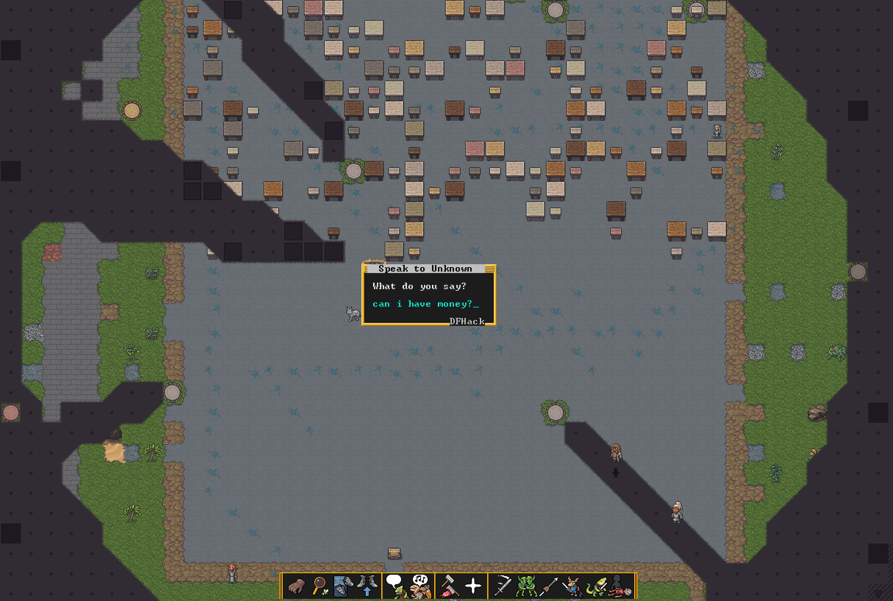
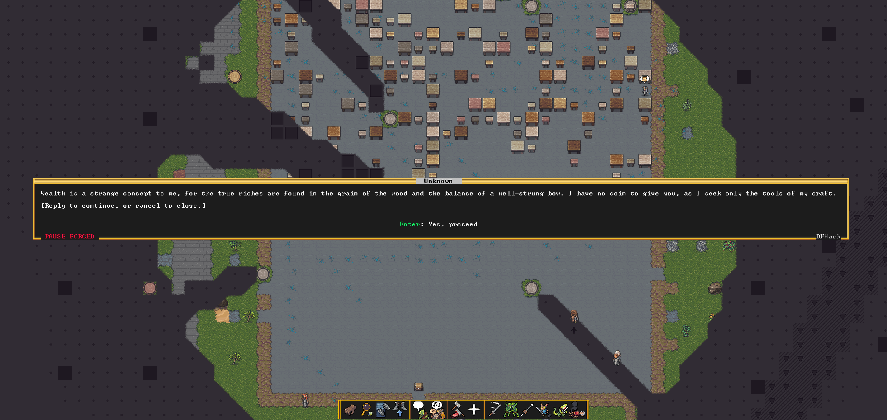

# dwarf-ai

LLM-driven NPC intelligence for **Dwarf Fortress** (Steam 50.x+) via **DFHack**. Every dwarf is a stateful agent with asymmetric knowledge, episodic memory, and autonomous behavior. The game process is unmodified — all intelligence runs in a Python sidecar.




## What it does

| Key / UI | Feature |
|---|---|
| **F9** / click **"Speak freely (AI)"** button | Talk to any NPC — personality, wounds, spatial context fed to LLM |
| **E** | Eavesdrop on nearby dwarf-to-dwarf tavern conversations |
| **M** | Mayor's briefing — fortress mood report from the expedition leader |

The "Speak freely (AI)" button is injected as an overlay into:
- fortress-mode unit sheets (right-click dwarf → View)
- adventure-mode unit interaction panels
- DF's built-in conversation screen (alongside the canned options)

Chat opens as a persistent panel with scrolling transcript. Enter to send, Esc to close, PgUp/PgDn to scroll.

### Words carry real consequences

Every reply returns a structured action that actually fires in-game:

| Action | Effect |
|---|---|
| `initiate_brawl` | NPC flips hostile + teleports adjacent → combat starts |
| `call_guards` | Red shout-for-help announcement |
| `issue_threat` | Threat text shown + persisted as a strong memory |
| `demand_payment` | Amount + reason announced |
| `offer_quest` | Quest announcement with title/objective/reward |
| `modify_mood` | Actual stress delta to the dwarf |
| `flee` | Retreat flag set |
| `opinion_delta` | Per-NPC reputation score persisted to disk |

The prompt explicitly tells Gemini: *if you say you'll fight, return `initiate_brawl`; words and action must match.* Threats aren't just flavor text — rob a shopkeeper and they'll actually attack you, call the guards, or remember the threat forever.

### Persistent memory

Every conversation turn is written to the NPC's ChromaDB collection. Opinions persist across bridge restarts in `chroma/opinions.json`. Come back tomorrow and the same NPC will remember what you said and how they felt about it.

### Token / cost telemetry

Every LLM call logs token counts and cost, plus a running session total. A 30-turn Adventure-Mode conversation with Gemini 3.1 Flash Lite Preview typically runs under $0.001.

**Background systems:**
- Per-dwarf ChromaDB episodic memory — dwarves remember their lives
- Sleep consolidation — daily events summarized into journal entries
- Autonomous pressure system — lonely/drunk/grieving dwarves act out spontaneously
- D2D pairing loop — idle dwarves hold conversations in taverns
- Legends RAG — NPCs answer questions using actual world history (export `legends.xml` first)

## Architecture

```
DFHack Lua scripts
  context_writer.lua    ← Ctrl+T → serialize full dwarf state → ipc/context/
  response_reader.lua   ← poll ipc/responses/ → display dialogue + apply actions
  action_executor.lua   ← validate JSON commands; write replan on failure
  state/dwarf_state.lua ← personality facets, wounds, alcohol, emotions
  state/world_state.lua ← 5×5 tile scan, room description, "Theory of You"
  lod_manager.lua       ← AI LOD: only active/focus dwarves get API calls
  event_hooks.lua       ← death/combat/mood → episodic memory events
  ui/mayor_briefing.lua ← fortress mood report screen
  ui/eavesdrop_view.lua ← tavern D2D conversation viewer
  ui/screen_overlay.lua ← unit view / engraving overlays
          │ file IPC (JSON)
Python sidecar
  bridge.py             ← watchdog orchestrator + ThreadPoolExecutor
  context_router.py     ← priority dispatch (interactive > d2d > background)
  context_engine.py     ← declarative prompt builder (no raw game integers to LLM)
  llm_client.py         ← Gemini 3.1 Flash Lite Preview, response_schema, tenacity retry
  schemas.py            ← Pydantic action models (speak/brawl/flee/rant/mood)
  dwarf_pairing.py      ← D2D interaction scheduler
  legends_rag.py        ← Legends XML → ChromaDB → RAG queries
  memory/episodic.py    ← per-dwarf ChromaDB vector store
  memory/consolidator.py← sleep → journal entry summarization
  memory/pressure.py    ← autonomous pressure engine (loneliness/grief/frustration)
```

## Install

### Requirements
- Dwarf Fortress (Steam, 50.x+)
- DFHack (auto-installs via Steam launch after extracting to DF directory)
- Python 3.10+, WSL or Linux

### Setup

1. **DFHack**: Download `dfhack-5x.xx-rX-Windows-64bit.zip` from [DFHack releases](https://github.com/DFHack/dfhack/releases/latest). Extract into your DF Steam directory (merge). Relaunch DF — a DFHack console appears automatically.

2. **Deploy Lua scripts**:
   ```
   cp -r lua/scripts/* "C:/Program Files (x86)/Steam/steamapps/common/Dwarf Fortress/hack/scripts/dfai/"
   ```
   Copy `dfhack.init` to the DF root (or append its contents to an existing one).

3. **Python bridge**:
   ```bash
   pip install -r python/requirements.txt
   # Add GOOGLE_API_KEY to ~/.nemoclaw_env or export it
   cd python && python3 bridge.py
   ```

4. Launch DF. In Adventure Mode, walk up to an NPC and press **Ctrl+T**.

### Other LLM providers

Edit `python/config.yaml` — swap `model` for any Gemini variant. The bridge uses `google-genai` SDK directly; to use OpenAI or Anthropic, subclass `llm_client.py`.

### Legends RAG

Export `legends.xml` from DF Legends mode, drop it in the project root, restart the bridge. It auto-indexes on first run.

## License

MIT
